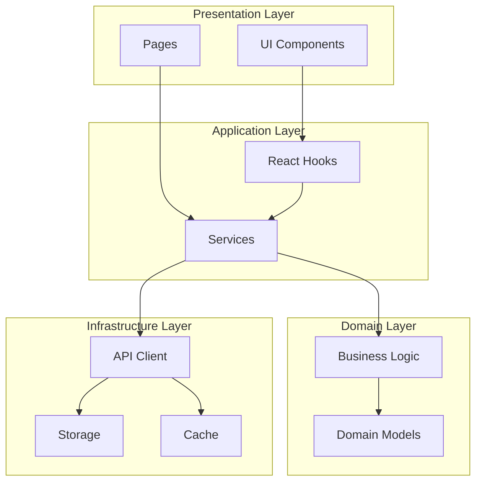
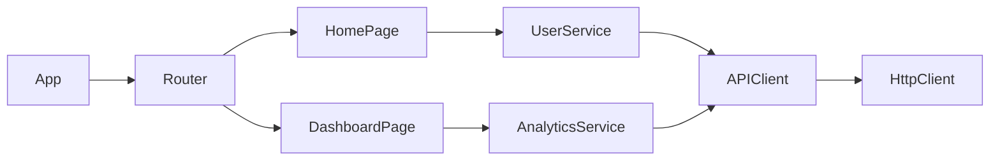

# Gemini CLI Module - Command Reference

> Complete documentation for all Gemini CLI module commands, options, and usage patterns.

## Table of Contents

1. [Overview](#overview)
2. [Command Structure](#command-structure)
3. [Core Commands](#core-commands)
   - [gemini enable](#gemini-enable)
   - [gemini disable](#gemini-disable)
   - [gemini status](#gemini-status)
   - [gemini auth](#gemini-auth)
   - [gemini logout](#gemini-logout)
4. [Analysis Commands](#analysis-commands)
   - [gemini analyze](#gemini-analyze)
   - [gemini architecture](#gemini-architecture)
   - [gemini security](#gemini-security)
   - [gemini dependencies](#gemini-dependencies)
   - [gemini coverage](#gemini-coverage)
5. [Utility Commands](#utility-commands)
   - [gemini cache](#gemini-cache)
   - [gemini config](#gemini-config)
   - [gemini eject](#gemini-eject)
   - [gemini update](#gemini-update)
6. [Global Options](#global-options)
7. [Output Formats](#output-formats)
8. [Environment Variables](#environment-variables)
9. [Configuration File](#configuration-file)
10. [Examples](#examples)

---

## Overview

The Gemini CLI module extends `claude-flow` with specialized commands for large-scale codebase analysis using Google's Gemini models.

### Command Prefix

All Gemini CLI commands are prefixed with `gemini`:

```bash
npx claude-flow gemini <command> [options]

# Or with the local CLI
./claude-flow gemini <command> [options]
```

### Help System

```bash
# Show all gemini commands
npx claude-flow gemini --help

# Show help for specific command
npx claude-flow gemini analyze --help
npx claude-flow gemini auth --help
```

---

## Command Structure

### Syntax

```
claude-flow gemini <command> [subcommand] [arguments] [options]
```

### Common Patterns

```bash
# Module management
claude-flow gemini enable|disable|status|eject

# Authentication
claude-flow gemini auth [method]
claude-flow gemini logout

# Analysis
claude-flow gemini analyze|architecture|security|dependencies|coverage [target] [options]

# Configuration
claude-flow gemini config [key] [value]
claude-flow gemini cache clear|stats
```

---

## Core Commands

### `gemini enable`

Enable the Gemini CLI module and install dependencies.

```bash
npx claude-flow gemini enable [options]
```

**Options:**

| Option | Alias | Description | Default |
|--------|-------|-------------|---------|
| `--auto-install` | `-i` | Automatically install Gemini CLI if not found | `true` |
| `--version` | `-v` | Specific Gemini CLI version to install | `latest` |
| `--skip-auth` | | Skip authentication prompt after enabling | `false` |
| `--force` | `-f` | Force re-enable even if already enabled | `false` |

**Examples:**

```bash
# Enable with defaults
npx claude-flow gemini enable

# Enable specific version
npx claude-flow gemini enable --version 0.1.34

# Enable without auto-install
npx claude-flow gemini enable --auto-install false

# Force re-enable
npx claude-flow gemini enable --force
```

**Output:**

```
✓ Checking Gemini CLI installation...
✓ Gemini CLI v0.1.34 found at /usr/local/bin/gemini
✓ Enabling Gemini CLI module...
✓ Module configuration created
✓ MCP tools registered (5 tools)

Gemini CLI module enabled successfully!

Next steps:
  1. Run 'claude-flow gemini auth' to authenticate
  2. Try 'claude-flow gemini analyze' to analyze your codebase
```

---

### `gemini disable`

Disable the Gemini CLI module without removing configuration.

```bash
npx claude-flow gemini disable [options]
```

**Options:**

| Option | Alias | Description | Default |
|--------|-------|-------------|---------|
| `--keep-config` | | Preserve configuration for later re-enable | `true` |
| `--keep-cache` | | Preserve analysis cache | `false` |
| `--force` | `-f` | Skip confirmation prompt | `false` |

**Examples:**

```bash
# Disable with confirmation
npx claude-flow gemini disable

# Disable and clear cache
npx claude-flow gemini disable --keep-cache false

# Force disable without prompt
npx claude-flow gemini disable --force
```

**Output:**

```
⚠ This will disable the Gemini CLI module.
  MCP tools will be unregistered.

Continue? [y/N]: y

✓ MCP tools unregistered
✓ Module disabled
✓ Configuration preserved (use --eject to remove)

Gemini CLI module disabled.
To re-enable: claude-flow gemini enable
```

---

### `gemini status`

Display current module status and configuration.

```bash
npx claude-flow gemini status [options]
```

**Options:**

| Option | Alias | Description | Default |
|--------|-------|-------------|---------|
| `--json` | `-j` | Output as JSON | `false` |
| `--verbose` | `-v` | Show detailed information | `false` |

**Examples:**

```bash
# Basic status
npx claude-flow gemini status

# Detailed status
npx claude-flow gemini status --verbose

# JSON output for scripts
npx claude-flow gemini status --json
```

**Output (Normal):**

```
Gemini CLI Module Status
========================

Status:        ✓ Enabled
Authenticated: ✓ Yes (Google Login)
CLI Version:   v0.1.34
CLI Path:      /usr/local/bin/gemini

Account:       user@example.com
Project:       my-project-123
Model:         gemini-1.5-pro

Cache:         128 MB / 1 GB used
Last Analysis: 2025-12-06 10:30:45
```

**Output (Verbose):**

```
Gemini CLI Module Status
========================

Module State:
  Enabled:       true
  Config Path:   ~/.claude-flow/modules/gemini-cli.json
  Installed At:  2025-12-01 08:00:00
  Last Modified: 2025-12-06 10:30:45

CLI Installation:
  Version:       0.1.34
  Path:          /usr/local/bin/gemini
  NPM Global:    true
  Auto-Update:   enabled

Authentication:
  Method:        google-login
  Account:       user@example.com
  Token Expiry:  2025-12-07 10:30:00 (23h remaining)
  Refresh Token: ✓ Valid

API Configuration:
  Model:         gemini-1.5-pro
  Context Limit: 1,000,000 tokens
  Rate Limit:    60 RPM / 1M TPM
  Quota Used:    15% (today)

Cache Statistics:
  Memory Cache:  45 MB / 100 MB
  File Cache:    128 MB / 1 GB
  Hit Rate:      78%
  Entries:       156

MCP Integration:
  Tools Registered: 5
  Disclosure Level: 2
  Async Support:    enabled
```

**Output (JSON):**

```json
{
  "enabled": true,
  "authenticated": true,
  "authMethod": "google-login",
  "account": "user@example.com",
  "cliVersion": "0.1.34",
  "cliPath": "/usr/local/bin/gemini",
  "model": "gemini-1.5-pro",
  "cache": {
    "memoryUsed": 47185920,
    "fileUsed": 134217728,
    "hitRate": 0.78
  },
  "lastAnalysis": "2025-12-06T10:30:45.000Z",
  "mcpTools": ["codebase_analyze", "architecture_map", "security_scan", "dependency_analyze", "coverage_assess"]
}
```

---

### `gemini auth`

Authenticate with Google/Gemini API.

```bash
npx claude-flow gemini auth [method] [options]
```

**Methods:**

| Method | Description |
|--------|-------------|
| `login` | Interactive browser-based OAuth (default) |
| `api-key` | API key authentication |
| `service-account` | Vertex AI service account |

**Options:**

| Option | Alias | Description | Default |
|--------|-------|-------------|---------|
| `--method` | `-m` | Authentication method | `login` |
| `--api-key` | `-k` | Gemini API key (for api-key method) | - |
| `--service-account` | `-s` | Path to service account JSON | - |
| `--project` | `-p` | GCP project ID | - |
| `--region` | `-r` | GCP region for Vertex AI | `us-central1` |
| `--no-browser` | | Don't open browser automatically | `false` |
| `--force` | `-f` | Force re-authentication | `false` |

**Examples:**

```bash
# Interactive login (recommended)
npx claude-flow gemini auth login

# API key authentication
npx claude-flow gemini auth api-key --api-key YOUR_API_KEY

# Or via environment variable
export GEMINI_API_KEY=YOUR_API_KEY
npx claude-flow gemini auth api-key

# Vertex AI service account
npx claude-flow gemini auth service-account \
  --service-account ./service-account.json \
  --project my-gcp-project \
  --region us-central1

# Force re-authentication
npx claude-flow gemini auth login --force
```

**Output (Login):**

```
Gemini CLI Authentication
=========================

Opening browser for Google authentication...
(If browser doesn't open, visit: https://accounts.google.com/o/oauth2/auth?...)

Waiting for authentication...

✓ Authentication successful!

Account:  user@example.com
Project:  my-project-123
Expires:  2025-12-07 10:30:00

You can now use Gemini CLI analysis tools.
```

**Output (API Key):**

```
Gemini CLI Authentication
=========================

✓ API key validated
✓ Credentials stored securely

API Key:  ****...****ABC1 (last 4 chars)
Model:    gemini-1.5-pro
Quota:    1,000,000 tokens/minute

You can now use Gemini CLI analysis tools.
```

---

### `gemini logout`

Clear authentication credentials.

```bash
npx claude-flow gemini logout [options]
```

**Options:**

| Option | Alias | Description | Default |
|--------|-------|-------------|---------|
| `--force` | `-f` | Skip confirmation | `false` |
| `--revoke` | | Revoke OAuth tokens (Google Login only) | `false` |

**Examples:**

```bash
# Logout with confirmation
npx claude-flow gemini logout

# Force logout
npx claude-flow gemini logout --force

# Logout and revoke tokens
npx claude-flow gemini logout --revoke
```

**Output:**

```
Gemini CLI Logout
=================

Current account: user@example.com

This will:
  • Clear stored credentials
  • End current session

Continue? [y/N]: y

✓ Credentials cleared
✓ Session ended

Note: Use 'claude-flow gemini auth' to authenticate again.
```

---

## Analysis Commands

### `gemini analyze`

Perform comprehensive codebase analysis.

```bash
npx claude-flow gemini analyze [target] [options]
```

**Arguments:**

| Argument | Description | Default |
|----------|-------------|---------|
| `target` | Path to analyze | `.` (current directory) |

**Options:**

| Option | Alias | Description | Default |
|--------|-------|-------------|---------|
| `--depth` | `-d` | Analysis depth: `surface`, `moderate`, `deep`, `comprehensive` | `moderate` |
| `--focus` | | Focus areas (comma-separated): `quality`, `patterns`, `dependencies`, `security`, `performance` | all |
| `--include` | `-i` | Glob patterns to include | common source patterns |
| `--exclude` | `-e` | Glob patterns to exclude | common ignore patterns |
| `--max-files` | | Maximum files to analyze | `100` |
| `--output` | `-o` | Output format: `text`, `json`, `markdown`, `html` | `text` |
| `--output-file` | | Save output to file | - |
| `--no-cache` | | Skip cache, force fresh analysis | `false` |
| `--async` | | Run analysis asynchronously | auto |
| `--quiet` | `-q` | Minimal output (only results) | `false` |
| `--verbose` | `-v` | Detailed progress output | `false` |

**Examples:**

```bash
# Basic analysis
npx claude-flow gemini analyze

# Analyze specific directory
npx claude-flow gemini analyze ./src

# Deep analysis with specific focus
npx claude-flow gemini analyze --depth deep --focus quality,patterns

# Include only TypeScript files
npx claude-flow gemini analyze --include "**/*.ts,**/*.tsx"

# Exclude test files
npx claude-flow gemini analyze --exclude "**/*.test.ts,**/__tests__/**"

# Output as JSON
npx claude-flow gemini analyze --output json

# Save to file
npx claude-flow gemini analyze --output markdown --output-file analysis.md

# Force fresh analysis
npx claude-flow gemini analyze --no-cache
```

**Output (Text):**

```
Codebase Analysis
=================

Target: ./src
Depth: moderate
Files: 87 analyzed

Summary
-------
Your codebase shows good overall structure with some areas for improvement.
The code follows consistent patterns for the most part, with TypeScript
providing strong type safety.

Key Findings (12 total)
-----------------------

HIGH PRIORITY:
  • [SECURITY] Potential XSS vulnerability in src/utils/render.ts:45
    - User input rendered without sanitization
    - Suggestion: Use DOMPurify or escape HTML entities

  • [QUALITY] Complex function exceeds recommended length
    - src/services/api.ts:processData() - 245 lines
    - Suggestion: Break into smaller, focused functions

MEDIUM PRIORITY:
  • [PATTERN] Inconsistent error handling in API layer
    - Some functions throw, others return null
    - Suggestion: Standardize on Result<T, E> pattern

  • [DEPENDENCY] Unused dependencies detected
    - lodash (unused, 1.4MB)
    - moment (deprecated, use date-fns)

LOW PRIORITY:
  • [QUALITY] Missing JSDoc on exported functions (23 files)
  • [PATTERN] Mixed async patterns (callbacks and promises)

Metrics
-------
  Lines of Code:     15,234
  Files:             87
  Complexity (avg):  4.2
  Duplication:       3.8%
  Test Coverage:     67%

Recommendations
---------------
1. Address security vulnerability in render.ts immediately
2. Refactor processData() function for maintainability
3. Standardize error handling across API layer
4. Remove unused dependencies to reduce bundle size
5. Add JSDoc documentation to exported functions

Analysis completed in 45.3s (32,456 tokens used)
```

---

### `gemini architecture`

Generate architecture diagrams and documentation.

```bash
npx claude-flow gemini architecture [target] [options]
```

**Options:**

| Option | Alias | Description | Default |
|--------|-------|-------------|---------|
| `--format` | `-f` | Diagram format: `mermaid`, `plantuml`, `dot`, `json` | `mermaid` |
| `--diagrams` | `-d` | Diagram types (comma-separated): `component`, `dependency`, `sequence`, `class`, `flow`, `deployment` | `component,dependency` |
| `--include-external` | | Include external dependencies | `false` |
| `--depth` | | Maximum dependency depth | `3` |
| `--output` | `-o` | Output file path | stdout |
| `--group-by` | | Grouping strategy: `directory`, `layer`, `domain` | `directory` |

**Examples:**

```bash
# Generate component and dependency diagrams
npx claude-flow gemini architecture

# Generate all diagram types
npx claude-flow gemini architecture --diagrams component,dependency,sequence,class

# PlantUML format
npx claude-flow gemini architecture --format plantuml

# Include external dependencies
npx claude-flow gemini architecture --include-external

# Save to file
npx claude-flow gemini architecture --output architecture.md
```

**Output (Mermaid):**

```
Architecture Analysis
=====================

Target: ./src
Components: 24
Layers: 4

Component Diagram
-----------------



Dependency Graph
----------------



Layer Summary
-------------

| Layer | Components | Dependencies |
|-------|------------|--------------|
| Presentation | 8 | 12 |
| Application | 6 | 18 |
| Domain | 5 | 4 |
| Infrastructure | 5 | 8 |

Analysis completed in 23.1s
```

---

### `gemini security`

Run security vulnerability scan.

```bash
npx claude-flow gemini security [target] [options]
```

**Options:**

| Option | Alias | Description | Default |
|--------|-------|-------------|---------|
| `--scan-types` | `-t` | Scan types (comma-separated) | `injection,xss,secrets,misconfig` |
| `--severity` | `-s` | Minimum severity: `info`, `low`, `medium`, `high`, `critical` | `low` |
| `--include-remediation` | | Include fix suggestions | `true` |
| `--scan-dependencies` | | Scan dependencies for CVEs | `true` |
| `--output` | `-o` | Output format: `text`, `json`, `sarif` | `text` |
| `--output-file` | | Save report to file | - |
| `--fail-on` | | Fail if severity found: `low`, `medium`, `high`, `critical` | - |

**Scan Types:**

- `injection` - SQL, Command, LDAP injection
- `authentication` - Auth bypass, weak passwords
- `xss` - Cross-site scripting
- `xxe` - XML external entities
- `access_control` - Broken access control
- `misconfig` - Security misconfiguration
- `components` - Vulnerable components
- `logging` - Insufficient logging
- `deserialization` - Insecure deserialization
- `secrets` - Hardcoded secrets/credentials
- `cryptography` - Weak crypto
- `input_validation` - Missing input validation
- `error_handling` - Information leakage

**Examples:**

```bash
# Full security scan
npx claude-flow gemini security

# Scan for critical issues only
npx claude-flow gemini security --severity critical

# Specific scan types
npx claude-flow gemini security --scan-types injection,xss,secrets

# Output as SARIF for GitHub integration
npx claude-flow gemini security --output sarif --output-file security.sarif

# CI/CD: Fail on high severity
npx claude-flow gemini security --fail-on high
```

**Output (Text):**

```
Security Scan Report
====================

Target: ./src
Scan Types: injection, authentication, xss, secrets, misconfig
Severity Filter: low+

Summary
-------
┌────────────┬───────┐
│ Severity   │ Count │
├────────────┼───────┤
│ Critical   │     1 │
│ High       │     3 │
│ Medium     │     5 │
│ Low        │     8 │
│ Info       │    12 │
├────────────┼───────┤
│ Total      │    29 │
└────────────┴───────┘

Security Score: 68/100 (Needs Improvement)

Critical Issues
---------------

[CRITICAL] SQL Injection Vulnerability
  File: src/api/users.ts:78
  CWE: CWE-89
  OWASP: A03:2021 Injection

  Code:
    const query = `SELECT * FROM users WHERE id = ${userId}`;

  Description:
    User input directly concatenated into SQL query without
    parameterization, allowing SQL injection attacks.

  Remediation:
    Use parameterized queries:
    const query = 'SELECT * FROM users WHERE id = $1';
    const result = await db.query(query, [userId]);

High Issues
-----------

[HIGH] Hardcoded API Key Detected
  File: src/config/api.ts:12
  Type: API Key

  Masked Value: AIza****...****7B2x

  Remediation:
    Move to environment variable:
    const API_KEY = process.env.GOOGLE_API_KEY;

[HIGH] XSS Vulnerability
  File: src/components/Comment.tsx:34
  CWE: CWE-79

  Code:
    <div dangerouslySetInnerHTML={{ __html: comment.body }} />

  Remediation:
    Sanitize HTML before rendering:
    import DOMPurify from 'dompurify';
    <div dangerouslySetInnerHTML={{ __html: DOMPurify.sanitize(comment.body) }} />

[... more issues ...]

Dependency Vulnerabilities
--------------------------

┌────────────────────┬─────────┬──────────┬─────────────┐
│ Package            │ Version │ Severity │ Fix Version │
├────────────────────┼─────────┼──────────┼─────────────┤
│ lodash             │ 4.17.19 │ High     │ 4.17.21     │
│ axios              │ 0.21.0  │ High     │ 0.21.2      │
│ node-fetch         │ 2.6.0   │ Medium   │ 2.6.7       │
└────────────────────┴─────────┴──────────┴─────────────┘

Recommendations
---------------
1. [CRITICAL] Fix SQL injection in users.ts immediately
2. [HIGH] Remove hardcoded API key and use environment variables
3. [HIGH] Sanitize HTML content before rendering
4. [HIGH] Update vulnerable dependencies

Scan completed in 67.2s (48,234 tokens used)
```

---

### `gemini dependencies`

Analyze project dependencies.

```bash
npx claude-flow gemini dependencies [target] [options]
```

**Options:**

| Option | Alias | Description | Default |
|--------|-------|-------------|---------|
| `--analysis` | `-a` | Analysis types (comma-separated): `updates`, `security`, `licenses`, `duplicates`, `unused`, `size` | `updates,security,licenses` |
| `--include-dev` | | Include dev dependencies | `true` |
| `--check-transitive` | | Check transitive dependencies | `true` |
| `--license-policy` | | Path to license policy JSON | - |
| `--output` | `-o` | Output format: `text`, `json` | `text` |

**Examples:**

```bash
# Full dependency analysis
npx claude-flow gemini dependencies

# Check for updates only
npx claude-flow gemini dependencies --analysis updates

# With license policy
npx claude-flow gemini dependencies --license-policy ./license-policy.json

# Exclude dev dependencies
npx claude-flow gemini dependencies --include-dev false
```

**Output:**

```
Dependency Analysis
===================

Target: ./package.json
Type: npm (Node.js)

Summary
-------
Total Dependencies: 156
  Direct:           45
  Dev:              32
  Transitive:       79

Outdated:           12
Vulnerable:          3
License Issues:      2

Updates Available
-----------------

Major Updates (Breaking):
┌────────────────────┬─────────┬─────────┬────────────────────────┐
│ Package            │ Current │ Latest  │ Notes                  │
├────────────────────┼─────────┼─────────┼────────────────────────┤
│ react              │ 17.0.2  │ 18.2.0  │ Major version update   │
│ typescript         │ 4.9.5   │ 5.3.2   │ Breaking changes       │
│ webpack            │ 4.46.0  │ 5.89.0  │ Migration guide needed │
└────────────────────┴─────────┴─────────┴────────────────────────┘

Minor Updates (Safe):
┌────────────────────┬─────────┬─────────┐
│ Package            │ Current │ Latest  │
├────────────────────┼─────────┼─────────┤
│ axios              │ 1.4.0   │ 1.6.2   │
│ date-fns           │ 2.29.0  │ 2.30.0  │
│ zustand            │ 4.3.0   │ 4.4.7   │
└────────────────────┴─────────┴─────────┘

Security Vulnerabilities
------------------------
[See `gemini security` for details]

License Compliance
------------------

┌────────────────────┬─────────────┬────────────┐
│ Package            │ License     │ Status     │
├────────────────────┼─────────────┼────────────┤
│ react              │ MIT         │ ✓ Allowed  │
│ lodash             │ MIT         │ ✓ Allowed  │
│ gpl-package        │ GPL-3.0     │ ✗ Denied   │
│ unknown-pkg        │ Unknown     │ ⚠ Review   │
└────────────────────┴─────────────┴────────────┘

Size Analysis
-------------

Total Bundle: 2.4 MB (minified + gzipped)

Largest Dependencies:
┌────────────────────┬────────────┬───────────┐
│ Package            │ Size       │ % Bundle  │
├────────────────────┼────────────┼───────────┤
│ moment             │ 289 KB     │ 12.0%     │
│ lodash             │ 72 KB      │ 3.0%      │
│ axios              │ 29 KB      │ 1.2%      │
└────────────────────┴────────────┴───────────┘

Recommendations:
  • Replace moment (289KB) with date-fns (7KB)
  • Use lodash-es for tree-shaking
  • Consider axios alternatives (ky, unfetch)

Analysis completed in 18.4s
```

---

### `gemini coverage`

Assess test coverage quality.

```bash
npx claude-flow gemini coverage [target] [options]
```

**Options:**

| Option | Alias | Description | Default |
|--------|-------|-------------|---------|
| `--coverage-data` | `-c` | Path to coverage report (lcov, istanbul) | auto-detect |
| `--analysis` | `-a` | Analysis types: `gaps`, `quality`, `suggestions`, `critical_paths` | `gaps,suggestions` |
| `--target-coverage` | `-t` | Target coverage percentage | `80` |
| `--focus` | `-f` | Focus on specific files/directories | - |
| `--output` | `-o` | Output format: `text`, `json`, `markdown` | `text` |

**Examples:**

```bash
# Analyze coverage
npx claude-flow gemini coverage

# With existing coverage report
npx claude-flow gemini coverage --coverage-data ./coverage/lcov.info

# Focus on specific directory
npx claude-flow gemini coverage --focus src/services

# Set target coverage
npx claude-flow gemini coverage --target-coverage 90
```

**Output:**

```
Test Coverage Assessment
========================

Target: ./src
Current Coverage: 67%
Target Coverage: 80%
Gap: 13%

Coverage Summary
----------------

┌─────────────────┬──────────┬────────┐
│ Metric          │ Current  │ Target │
├─────────────────┼──────────┼────────┤
│ Line Coverage   │ 67%      │ 80%    │
│ Branch Coverage │ 58%      │ 80%    │
│ Function Coverage│ 72%     │ 80%    │
│ Statement Coverage│ 69%    │ 80%    │
└─────────────────┴──────────┴────────┘

Files with Lowest Coverage
--------------------------

┌────────────────────────────────────┬──────────┬──────────┐
│ File                               │ Coverage │ Priority │
├────────────────────────────────────┼──────────┼──────────┤
│ src/services/payment.ts            │ 23%      │ Critical │
│ src/utils/validation.ts            │ 34%      │ High     │
│ src/api/orders.ts                  │ 41%      │ High     │
│ src/hooks/useAuth.ts               │ 45%      │ Medium   │
│ src/components/Checkout.tsx        │ 52%      │ Medium   │
└────────────────────────────────────┴──────────┴──────────┘

Critical Untested Paths
-----------------------

1. Payment Processing (src/services/payment.ts)
   Risk: HIGH - Financial transaction handling
   Untested Functions:
     • processPayment()
     • handleRefund()
     • validateCard()

   Suggested Tests:
     - Test successful payment flow
     - Test payment failure scenarios
     - Test refund processing
     - Test card validation edge cases

2. Order Validation (src/api/orders.ts)
   Risk: MEDIUM - Data integrity
   Untested Functions:
     • validateOrder()
     • calculateTotals()

   Suggested Tests:
     - Test order with valid items
     - Test empty order rejection
     - Test price calculation accuracy

Test Suggestions
----------------

Priority 1: Payment Service Tests
```typescript
// tests/services/payment.test.ts
describe('PaymentService', () => {
  describe('processPayment', () => {
    it('should process valid payment', async () => {
      const result = await paymentService.processPayment({
        amount: 100,
        currency: 'USD',
        cardToken: 'tok_valid'
      });
      expect(result.success).toBe(true);
    });

    it('should handle insufficient funds', async () => {
      await expect(paymentService.processPayment({
        amount: 100,
        cardToken: 'tok_insufficient'
      })).rejects.toThrow('Insufficient funds');
    });
  });
});
```

Priority 2: Validation Tests
```typescript
// tests/utils/validation.test.ts
describe('validateEmail', () => {
  it.each([
    ['valid@email.com', true],
    ['invalid-email', false],
    ['', false],
  ])('should validate %s as %s', (email, expected) => {
    expect(validateEmail(email)).toBe(expected);
  });
});
```

Improvement Plan
----------------

Week 1: Critical coverage gaps (payment.ts)
  Target: 23% → 70%
  Effort: ~4 hours

Week 2: High priority gaps (validation.ts, orders.ts)
  Target: 38% → 75%
  Effort: ~6 hours

Week 3: Medium priority files
  Target: 48% → 80%
  Effort: ~4 hours

Estimated time to 80% coverage: 14 hours

Analysis completed in 28.7s
```

---

## Utility Commands

### `gemini cache`

Manage analysis cache.

```bash
npx claude-flow gemini cache <subcommand> [options]
```

**Subcommands:**

| Subcommand | Description |
|------------|-------------|
| `stats` | Show cache statistics |
| `clear` | Clear cache |
| `list` | List cached analyses |

**Options (clear):**

| Option | Alias | Description | Default |
|--------|-------|-------------|---------|
| `--older-than` | | Clear entries older than (e.g., `7d`, `24h`) | - |
| `--target` | | Clear cache for specific target | - |
| `--force` | `-f` | Skip confirmation | `false` |

**Examples:**

```bash
# Show cache stats
npx claude-flow gemini cache stats

# Clear all cache
npx claude-flow gemini cache clear

# Clear old entries
npx claude-flow gemini cache clear --older-than 7d

# Clear cache for specific target
npx claude-flow gemini cache clear --target ./src
```

---

### `gemini config`

Manage module configuration.

```bash
npx claude-flow gemini config [key] [value] [options]
```

**Options:**

| Option | Alias | Description | Default |
|--------|-------|-------------|---------|
| `--list` | `-l` | List all configuration | `false` |
| `--reset` | | Reset to defaults | `false` |
| `--edit` | | Open config in editor | `false` |

**Configuration Keys:**

| Key | Type | Description | Default |
|-----|------|-------------|---------|
| `model` | string | Gemini model to use | `gemini-1.5-pro` |
| `maxTokens` | number | Max tokens per request | `1000000` |
| `cacheEnabled` | boolean | Enable caching | `true` |
| `cacheTTL` | number | Cache TTL in ms | `3600000` |
| `excludePatterns` | string[] | Default exclude patterns | common |
| `rateLimit.rpm` | number | Requests per minute | `60` |
| `rateLimit.tpm` | number | Tokens per minute | `1000000` |

**Examples:**

```bash
# List all config
npx claude-flow gemini config --list

# Get specific value
npx claude-flow gemini config model

# Set value
npx claude-flow gemini config model gemini-1.5-flash

# Reset to defaults
npx claude-flow gemini config --reset

# Edit in editor
npx claude-flow gemini config --edit
```

---

### `gemini eject`

Completely remove the Gemini CLI module.

```bash
npx claude-flow gemini eject [options]
```

**Options:**

| Option | Alias | Description | Default |
|--------|-------|-------------|---------|
| `--force` | `-f` | Skip confirmation | `false` |
| `--keep-cli` | | Keep Gemini CLI installed | `false` |
| `--backup` | | Backup config before ejecting | `true` |

**Examples:**

```bash
# Eject with confirmation
npx claude-flow gemini eject

# Force eject
npx claude-flow gemini eject --force

# Eject but keep CLI
npx claude-flow gemini eject --keep-cli
```

**Output:**

```
Gemini CLI Module Ejection
==========================

This will PERMANENTLY REMOVE:
  ✗ Module configuration
  ✗ Authentication credentials
  ✗ Cache data
  ✗ MCP tool registrations

Continue? [y/N]: y

Creating backup... ✓
  Backup saved: ~/.claude-flow/backups/gemini-cli-2025-12-06.tar.gz

Removing module...
  ✓ MCP tools unregistered
  ✓ Configuration removed
  ✓ Credentials cleared
  ✓ Cache cleared

Gemini CLI module ejected successfully.

To reinstall: npx claude-flow gemini enable
To restore backup: tar -xzf ~/.claude-flow/backups/gemini-cli-2025-12-06.tar.gz
```

---

### `gemini update`

Update Gemini CLI to latest version.

```bash
npx claude-flow gemini update [options]
```

**Options:**

| Option | Alias | Description | Default |
|--------|-------|-------------|---------|
| `--version` | `-v` | Specific version to install | `latest` |
| `--check` | `-c` | Check for updates only | `false` |

**Examples:**

```bash
# Update to latest
npx claude-flow gemini update

# Check for updates
npx claude-flow gemini update --check

# Install specific version
npx claude-flow gemini update --version 0.1.35
```

---

## Global Options

These options are available for all commands:

| Option | Alias | Description | Default |
|--------|-------|-------------|---------|
| `--help` | `-h` | Show help | `false` |
| `--version` | `-V` | Show version | `false` |
| `--quiet` | `-q` | Suppress non-essential output | `false` |
| `--verbose` | `-v` | Verbose output | `false` |
| `--debug` | | Debug mode | `false` |
| `--no-color` | | Disable colored output | `false` |
| `--config` | | Path to config file | auto |

---

## Output Formats

### Text (Default)

Human-readable formatted output with colors and tables.

### JSON

Machine-readable JSON output for scripting:

```bash
npx claude-flow gemini analyze --output json | jq '.findings[].severity'
```

### Markdown

Markdown-formatted output for documentation:

```bash
npx claude-flow gemini analyze --output markdown > ANALYSIS.md
```

### SARIF (Security)

SARIF format for GitHub Advanced Security integration:

```bash
npx claude-flow gemini security --output sarif > security.sarif
```

---

## Environment Variables

| Variable | Description | Default |
|----------|-------------|---------|
| `GEMINI_API_KEY` | Gemini API key | - |
| `GOOGLE_APPLICATION_CREDENTIALS` | Service account path | - |
| `GEMINI_MODEL` | Default model | `gemini-1.5-pro` |
| `GEMINI_PROJECT` | GCP project ID | - |
| `GEMINI_REGION` | GCP region | `us-central1` |
| `GEMINI_CACHE_DIR` | Cache directory | `~/.claude-flow/cache/gemini` |
| `GEMINI_DEBUG` | Enable debug mode | `false` |
| `NO_COLOR` | Disable colors | `false` |

---

## Configuration File

Configuration is stored at `~/.claude-flow/modules/gemini-cli.json`:

```json
{
  "enabled": true,
  "version": "1.0.0",
  "cli": {
    "path": "/usr/local/bin/gemini",
    "version": "0.1.34",
    "autoUpdate": true
  },
  "auth": {
    "method": "google-login",
    "account": "user@example.com"
  },
  "api": {
    "model": "gemini-1.5-pro",
    "maxTokens": 1000000,
    "temperature": 0.1
  },
  "cache": {
    "enabled": true,
    "directory": "~/.claude-flow/cache/gemini",
    "maxSize": 1073741824,
    "ttl": 3600000
  },
  "analysis": {
    "excludePatterns": [
      "node_modules/**",
      ".git/**",
      "dist/**"
    ],
    "maxFiles": 100,
    "defaultDepth": "moderate"
  },
  "rateLimit": {
    "rpm": 60,
    "tpm": 1000000
  }
}
```

---

## Examples

### CI/CD Integration

```bash
#!/bin/bash
# .github/workflows/security-scan.yml

# Authenticate using API key
export GEMINI_API_KEY=${{ secrets.GEMINI_API_KEY }}
npx claude-flow gemini auth api-key

# Run security scan
npx claude-flow gemini security \
  --output sarif \
  --output-file security.sarif \
  --fail-on high

# Upload to GitHub Security
gh security upload sarif security.sarif
```

### Pre-commit Hook

```bash
#!/bin/bash
# .husky/pre-commit

# Quick security check on staged files
STAGED=$(git diff --cached --name-only --diff-filter=ACM)

if [ -n "$STAGED" ]; then
  npx claude-flow gemini security \
    --scan-types secrets,injection \
    --severity high \
    --fail-on high \
    $STAGED
fi
```

### Architecture Documentation

```bash
# Generate architecture docs
npx claude-flow gemini architecture \
  --diagrams component,dependency,sequence \
  --format mermaid \
  --output docs/ARCHITECTURE.md

# Generate for wiki
npx claude-flow gemini analyze \
  --depth comprehensive \
  --output markdown \
  --output-file docs/CODEBASE.md
```

---

## Related Documentation

- [README.md](./README.md) - Main module documentation
- [TYPES.md](./TYPES.md) - TypeScript interfaces
- [MCP-TOOLS.md](./MCP-TOOLS.md) - MCP integration
- [AUTHENTICATOR.md](./AUTHENTICATOR.md) - Authentication details

---

*Last Updated: December 2025*
*Version: 1.0.0*
